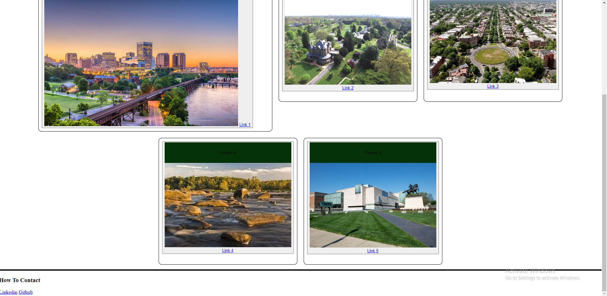
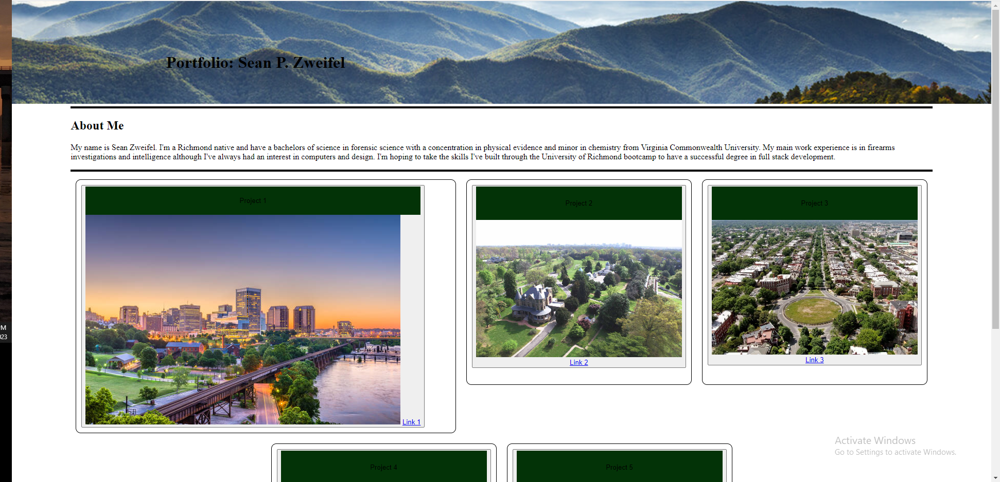

# hw2-Portfolio

# description
In this project, my aim was to build a portfolio website for future employers. I was not given any starter code and had to build the entire webpage from scratch. I included my name, links to contact me, an about me, and links to five of my most recent projects. Through this project, I learned and became familiar with a few concepts, such as, using CSS and HTML in concert to move links around and create usable navigation tools. I used flexbox throughout the project and became very familiar with it as well.

## License

MIT License

# Link to application

# screenshots

